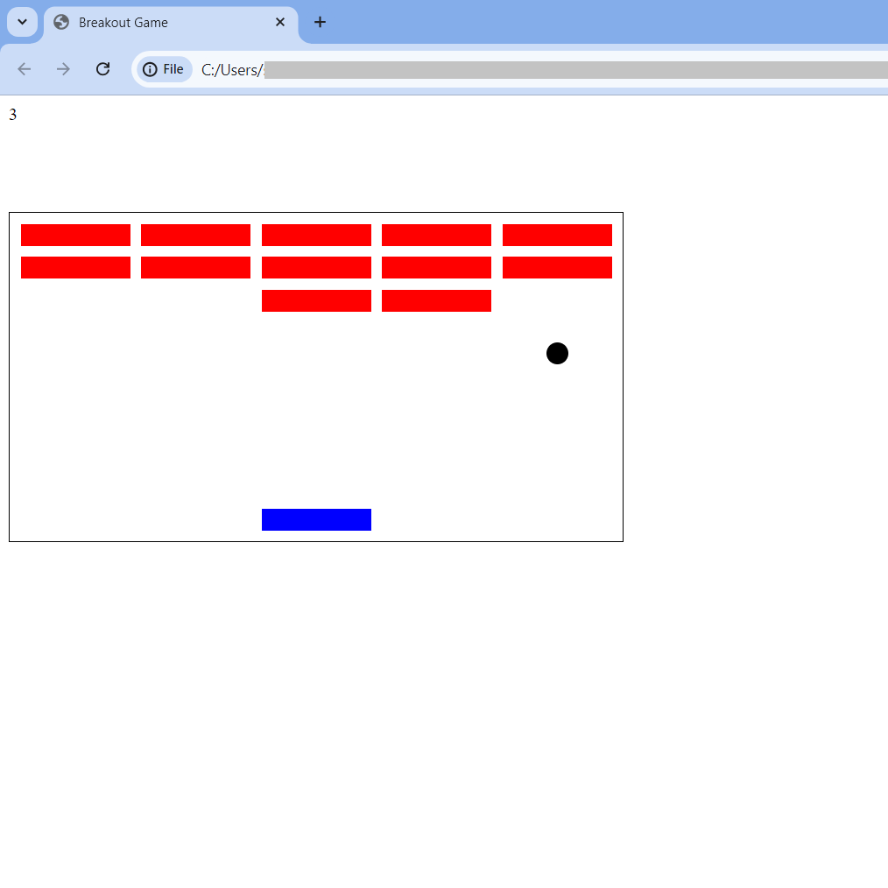

# Breakout_Game
 A simple Breakout-Game in JavaScript. 
 
 Game Link: https://s1997aniket.github.io/Breakout_Game/

 Setting up Locally:
 1. Download the 'Breakout_Game' folder to your local computer.
 2. Open the file 'index.html' in a web browser.
 3. Use the arrow keys to move the block in the bottom of the screen 
 to bounce the ball, and break the blocks on the top of the screen.
 
Google Drive Link:
https://drive.google.com/drive/folders/1dr2Yn-Rg9qQivjxG78O7dmdgv8mU-xC5?usp=share_link

## Snapshots:

1. Gameplay:

